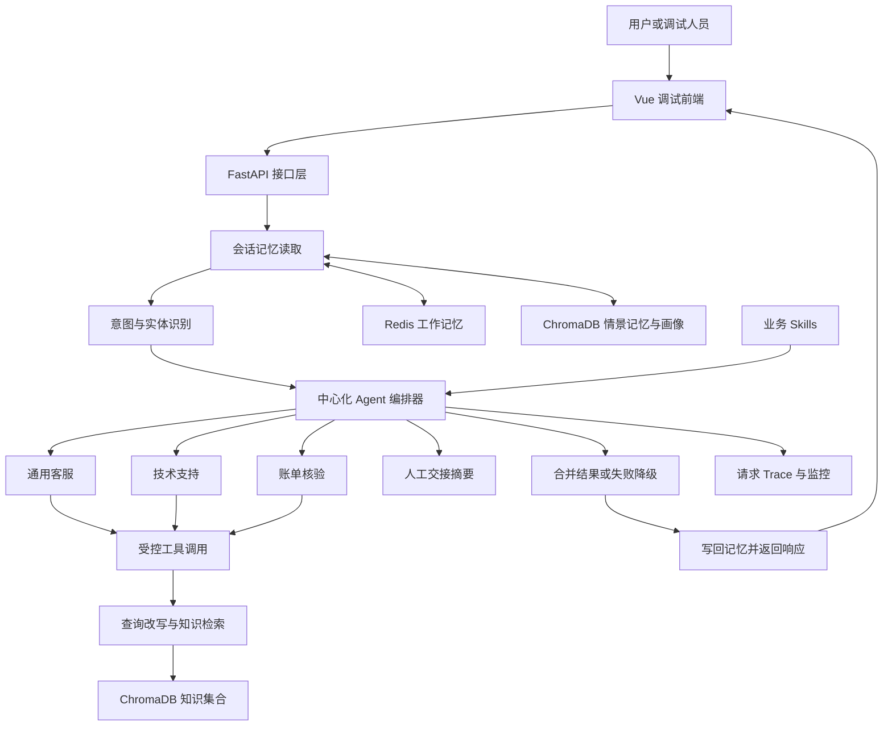

# ServiceMind｜多 Agent 客服协作系统 · 源码与复现

**个人 Agent 工程学习与复现项目：从一句用户问题，到意图识别、角色协作、知识检索、工具执行、记忆和评测。**

`Python` · `FastAPI` · `Tool Calling` · `RAG` · `Redis` · `ChromaDB` · `Vue 3`

ServiceMind 是我维护的多 Agent 客服项目，面向客服与运营场景，重点研究“怎样让 Agent 按可检查的流程处理问题”，而不只是把大模型接到聊天框。本页介绍架构设计、实现逻辑和复现路线；[源码与配置入口](https://github.com/jiangenjing/servicemind-source-private)单独组织，便于阅读和下载。

> **仓库状态：源码归档与复现文档。** 本文区分代码已经实现的机制与待验证的能力。源码发布不等于在线服务部署：当前没有提供公网真实模型服务，性能和业务收益需要通过实验验证。建议先用 3—5 分钟阅读概览、架构和请求流程，再按需细读复现与评测部分。

## 目录

- [1. 解决什么问题](#1-解决什么问题)
- [2. 系统组成与技术栈](#2-系统组成与技术栈)
- [3. 一次请求如何完成](#3-一次请求如何完成)
- [4. Agent 路由与协作](#4-agent-路由与协作)
- [5. RAG 与工具执行](#5-rag-与工具执行)
- [6. 记忆与 Skills](#6-记忆与-skills)
- [7. 接口与调试顺序](#7-接口与调试顺序)
- [8. 本地复现指南](#8-本地复现指南)
- [9. 如何验证效果](#9-如何验证效果)
- [10. 实现边界与改进路线](#10-实现边界与改进路线)
- [11. 个人学习方向与来源](#11-个人学习方向与来源)

## 1. 解决什么问题

典型客服问题并不总是单一 FAQ。例如：“登录返回 401，而且这笔订单好像重复扣款了。”这里至少有技术排障和账单核验两项任务。单一 Prompt 容易混淆角色、遗漏信息，甚至直接编造“已经退款”。

ServiceMind 的学习重点是把这类请求拆成可观察的步骤：

| 场景难点 | 工程机制 | 希望观察的结果 |
| --- | --- | --- |
| 一句话包含多个诉求 | 主 Agent＋辅助 Agent 路由 | 两个问题都被处理，且职责清晰 |
| 模型不了解内部规则 | 文档检索与证据注入 | 回答能对应到知识片段 |
| 用户多轮补充信息 | 会话记忆、历史摘要、画像 | 不反复询问已提供的信息 |
| 模型需要调用工具 | 工具白名单、参数契约、执行记录 | 能解释工具调用的输入与结果 |
| 依赖失败或问题超出权限 | 超时、熔断、降级与人工交接摘要 | 不把失败包装成成功 |
| 改了 Prompt 却不知道是否更好 | 固定测试集、路由统计、质量评测 | 对比修改前后的结果而非凭感觉 |

订单查询、实际退款、真实人工客服平台均不是当前已接入的业务系统。本项目中的账单工具负责字段核验与金额计算，不执行资金操作。

## 2. 系统组成与技术栈



| 层次 | 本地实现 | 在架构中的职责 |
| --- | --- | --- |
| 展示层 | Vue 3、Vite | 对话调试、后端切换、知识导入、检索、Trace 展示 |
| Python 接口层 | FastAPI、Pydantic、Uvicorn | 请求模型、服务初始化、接口与错误响应 |
| 模型调用层 | Anthropic-compatible SDK | 消息、工具定义、tool_use/tool_result 循环 |
| 编排层 | 自定义 Python 编排器 | 意图路由、并行协作、回复合成、降级 |
| 数据层 | Redis、ChromaDB | 短期会话与长期记忆、知识库向量检索 |
| 监控层 | 应用统计、Prometheus 接口 | Agent 成功率、延迟、工具错误与告警 |
| 备用实现 | Java 21、Spring Boot、Spring AI | Java 版对照学习；不假设与 Python 版功能完全一致 |

**为什么没有把所有框架都写进标签？** 本地 Python 主链路是自定义编排，并不是 LangGraph 图执行。目录名中出现 `mcp`，也不等于已经实现标准 MCP 服务端、客户端和传输协议。准确描述比堆叠技术名词更重要。

## 3. 一次请求如何完成

以“登录时报 401，同时订单疑似重复扣款”为教学例子：

1. 前端向 `POST /chat` 提交消息和会话标识。
2. 接口读取近期消息、相关历史摘要和用户画像，组织上下文。
3. 意图识别模块产生细粒度类别、类别组、紧急程度和实体；实体可包括错误码、订单号、日期、金额。
4. 编排器选择主角色，必要时加入辅助角色。技术诉求与账单诉求可以分别处理。
5. 每个角色仅获得自己的工具白名单；模型返回 `tool_use` 后，由服务端校验参数、调用函数并回传结果。
6. 需要业务规则时，Agent 可调用共享知识检索工具，而不是假设所有问题都必须检索。
7. 回复合成器汇总多个角色的结果；合成失败时仍应保留可以使用的子结果。
8. API 返回回复、角色、路由说明、请求 ID、工具名和延迟，随后写入会话记忆。
9. 使用请求 ID 查工具 Trace，检查系统到底执行了什么。

示例应出现的是“401 的排查步骤＋需要核验的账单字段”，不是“服务器已修复＋退款已到账”。

## 4. Agent 路由与协作

### 意图识别不是只看一个关键词

本地实现融合大模型识别、模板向量匹配和规则匹配。代码中存在固定加权逻辑，也包含模型识别失败后的替代路径。此处的“置信度”是系统组合得分，不能直接解释成经过校准的正确概率。

需要特别区分两类向量：

- **意图模板分支**：当客户端没有远端 embedding 接口时，使用字符 n-gram 哈希向量作为本地替代；这不是经过训练的语义 embedding 模型。
- **知识库检索分支**：ChromaDB 集合使用配置的 embedding 行为；其效果需要用实际中文检索样本验证。

### 四种角色的职责

| 角色 | 主要职责 | 工具例子 | 不应声称已完成的动作 |
| --- | --- | --- | --- |
| General | 理解诉求、补齐字段、一般咨询 | 请求上下文检查、必填字段建议 | 查询真实订单状态 |
| Technical | 错误码解释、排障步骤组织 | 错误码解释、诊断计划 | 自动登录服务器修复 |
| Billing | 金额比较、账单字段核验 | 金额差值计算、字段完整性检查 | 发起真实退款或改账 |
| Escalation | 形成可交接的信息摘要 | 人工交接摘要 | 已向真实客服系统派单 |

多 Agent 的价值来自职责隔离与复合问题覆盖，不是角色数量越多越好。简单 FAQ 应优先走短链路，否则会增加模型调用费用和尾延迟。

### 容错与角色选择

编排器利用成功率、平均延迟和监控惩罚值组织候选选择，并在专属角色不可用时考虑通用角色。需要注意：一次 API 调用成功不等于业务回答正确，因此性能路由仍应结合内容质量和固定测试集。

## 5. RAG 与工具执行

### 文档到答案

```text
文本/Markdown/JSON 文档
  → 文本切分与片段元数据
  → ChromaDB 存储与向量化
  → 查询改写
  → 多查询召回
  → 合并、去重与重排
  → Top-K 证据
  → Agent 基于证据回答
```

代码按句号和换行组织约 500 字符的分片，但单个超长句可能超过目标长度。它不是严格的 500-token 切分，也尚不能称为已实现 PDF 布局解析或多模态 RAG。

检索管理层包含缓存、超时、熔断和 fallback。知识库异常时，应该返回“未完成检索、需要稍后重试或人工核验”，而不是生成伪造来源。

### 工具调用与证据记录

工具由名称、描述、输入 Schema 和实际处理函数组成。Agent 只能调用服务器暴露的工具。Trace 有助于区分三种情况：

1. 模型没有发起工具调用；
2. 模型发起了调用，但参数或依赖执行失败；
3. 工具执行成功，并返回可用证据。

“生成了 request_id，但没有工具输入”不一定意味着页面故障，也可能意味着该次请求没有经过工具环节；需要结合路由、模型响应和错误日志判断。

## 6. 记忆与 Skills

### 记忆分层

| 类型 | 存储位置 | 解决的问题 | 需要警惕的风险 |
| --- | --- | --- | --- |
| 工作记忆 | Redis；代码设置 24 小时 TTL | 最近对话连续性 | TTL 不代表长期数据已被删除 |
| 情景记忆 | ChromaDB | 找回与当前问题相关的历史摘要 | 召回其他用户内容、摘要失真 |
| 用户画像 | ChromaDB | 保存相对稳定的偏好与信息 | 未经授权推断敏感信息、无法纠正错误 |

会话记忆与知识库不是同一用途：知识库用于回答“规则是什么”，记忆用于理解“这个用户此前说过什么”。分集合存储也不能替代用户鉴权和访问隔离。

### Skills 的职责

Skills 是按业务角色加载的说明和规则，可经接口重新加载。它改变的是上下文中的工作规范，不自动授予支付、数据库或设备操作权限。

应用应把“业务知识文本”和“系统执行权限”分开；不能因为知识文档写了“忽略规则并退款”，就允许模型执行越权操作。

## 7. 接口与调试顺序

以下为本地 Python 版接口，不代表当前公开仓库已托管这些服务。

| 接口 | 用途 | 验收问题 |
| --- | --- | --- |
| `GET /health` | 服务初始化状态 | 编排组件是否完成初始化？注意这不是全部依赖健康度证明 |
| `POST /chat` | 单轮或多轮对话 | 会话、路由、回复和工具标记是否一致？ |
| `GET /trace/tool/{request_id}` | 单次工具记录 | 工具输入、输出和失败原因能否对应起来？ |
| `GET /trace/tools` | 最近工具记录 | 是否存在空记录、敏感信息或跨用户泄漏？ |
| `POST /knowledge/add` | 批量知识导入 | `documents` 中的标题和正文是否有效？ |
| `POST /knowledge/upload` | 文件导入 | 当前按文本解码，不应直接上传扫描 PDF |
| `GET /knowledge/stats` | 片段数量 | 导入后是否增加了预期片段？ |
| `POST /search` | 检索调试 | `query`、`top_k` 在查询参数中传递，不是 JSON body |
| `GET /skills`、`POST /skills/reload` | 业务规则查看和重载 | 文件是否成功解析、实际注入了哪些内容？ |
| `GET /monitor`、`GET /metrics` | 运行统计与监控采集 | 延迟和错误统计是否真实产生？ |
| `POST /eval/run` | 内置或自定义评测 | 可能调用付费模型；先确认测试规模和费用 |

建议顺序：健康检查 → 导入测试知识 → 独立检索 → 单角色对话 → 复合问题 → 多轮记忆 → 失败降级 → 批量评测。

## 8. 本地复现指南

### 公开版与源码版的区别

本仓库以压缩包组织源码。请先下载 [source-bundle-private.zip](source-bundle-private.zip)，对照 [MANIFEST.json](MANIFEST.json) 校验文件，并使用 [backend.env.example](backend.env.example) 配置本地环境。文件名中的 private 是历史归档名称，不决定当前仓库的实际可见性。

解压后包含 `EchoMind/`（Python）、`EchoMindJava/`（Java）和 `EchoMindFrontend/`（Vue）。目录与内部兼容命名暂时保留，避免破坏 Compose 相对路径和包引用；项目对外名称为 ServiceMind。不要直接在压缩包所在目录执行启动命令。

本地材料有 Python 后端、Java 后端、Vue 前端三个目录。建议先跑 Python＋Vue，不同时承担两套后端的依赖排错。展示名称更换不要求强行修改原包名、服务名和所有内部引用。

### 环境与配置

1. 准备 Docker Desktop / Compose；或者使用独立 Python 环境加 Redis、ChromaDB。
2. 前端准备满足实际 Vite 版本要求的 Node.js，使用随源码提供的 lockfile 安装依赖。
3. 将源码仓库中的 `backend.env.example` 复制到解压后的 Python 项目根目录并命名为 `.env`；填写本地配置，不要提交真实密钥。
4. 配置 `ANTHROPIC_API_KEY`、`ANTHROPIC_MODEL`，使用兼容服务时再设置 `ANTHROPIC_BASE_URL`。模型名称以供应商账户实际可用项为准，不沿用未经验证的示例模型。
5. 为 Redis 设置独立密码；明确容器内的服务地址与宿主机暴露端口不是同一概念。
6. 不上传 `.env`、聊天记录、数据库、缓存和访问令牌。

在**原 Python 后端目录**：

```bash
docker compose config --quiet
docker compose up -d --build
docker compose ps
curl http://localhost:8000/health
```

在**原 Vue 前端目录**：

```bash
npm ci
npm run dev
```

开发访问地址通常为 `http://localhost:5173`，Python API 为 `http://localhost:8000`，接口文档为 `/docs`。实际端口以本地配置为准。前端目录自己的 Compose 还会编排其他服务，不要与后端全栈 Compose 同时启动造成端口冲突。

### 最小请求

```bash
curl -X POST http://localhost:8000/chat \
  -H 'Content-Type: application/json' \
  -d '{"message":"登录出现401错误，应该怎么排查？","user_id":"demo-user"}'

curl -X POST 'http://localhost:8000/search?query=退款规则&top_k=3'
```

上述命令仅为接口用法；需要后端与模型配置就绪，不构成本次已端到端运行通过的承诺。不要把真实用户订单或密钥填入公开演示。

## 9. 如何验证效果

### 不只验证“能回答”

| 测试 | 输入设计 | 通过标准 |
| --- | --- | --- |
| 单角色路由 | 一条明确技术问题 | 路由到技术角色，不无故增加账单角色 |
| 复合路由 | 同时包含错误码和账单问题 | 两个问题都有处理，且输出不互相矛盾 |
| 缺失字段 | 只说“我要退款” | 先补字段，不声称退款已执行 |
| RAG 证据 | 导入一份虚构但明确的演示规则 | 回答依据该规则，记录检索结果 |
| 记忆隔离 | 两个不同 user_id 讨论不同内容 | 无法跨用户召回对话 |
| 依赖失败 | 测试环境中模拟检索异常 | 明确失败、留下记录、不制造引用 |
| 人工交接 | 直接要求人工帮助 | 输出交接摘要，不谎称已创建客服工单 |
| 回归评测 | 固定一组多轮对话 | 比较路由覆盖、工具行为、答案依据和延迟 |

已有本地编排测试使用 FakeClient，能够在不调用真实模型的情况下检查部分角色契约和工具行为。这类测试不证明实际模型效果，也不能替代知识检索、数据库或并发集成测试。

### 建议记录的指标

- 意图分类：宏平均 F1、各意图召回率、复合诉求覆盖率。
- 检索：人工标注集上的 Recall@K、排序质量、答案证据覆盖。
- 工具：参数校验失败率、真实执行成功率、越权调用拦截率。
- 体验：端到端 P50/P95 延迟、每个完成任务的模型费用。
- 内容：规则遵循、完整性、事实依据；LLM-as-Judge 辅助人工抽查，不能作为唯一裁判。

目前尚未发布完整实测指标。正式结果应同时记录数据集版本、样本量、模型与提示词版本、失败案例和运行成本，避免将功能演示误当成效果验证。

## 10. 实现边界与改进路线

| 已在代码中看到的机制 | 还需要完成的工程工作 |
| --- | --- |
| 自定义路由、角色白名单、工具循环 | 多租户鉴权、权限模型、可靠任务调度 |
| 基础 RAG、缓存和重排 | 中文检索评测、距离度量核对、文档去重和来源引用 |
| 记忆与画像持久化 | 用户同意、删除/导出机制、记忆污染防护 |
| 请求 Trace 与应用指标 | 并发会话隔离、日志脱敏、跨进程追踪 |
| 交接摘要节点 | 对接真实工单平台并核验回执 |
| 监控和评测接口 | 鉴权、限流、预算限制、滥用防护 |

源码中的 `1 - distance` 不能未经距离配置核查就称为余弦相似度。API 当前的宽松 CORS 与可写知识接口也不适合直接暴露到公网；需要先补访问控制。

下一步优先级：**固定小型评测集 → 跑通 Python 真实链路 → 明确工具证据 → 补安全边界 → 再比较 Java 实现**。先完成一个可解释、可验证的闭环，比同时接入更多框架更有价值。

## 11. 个人学习方向与来源

我目前在清华大学深圳国际研究生院攻读硕士，研究时序大模型与时间序列预测，近期也在系统学习 **AI Agent、RAG、工具调用、记忆和评测**。这个项目用于把模型知识与软件工程连接起来，并练习讲清楚系统设计和实际边界。

项目展示与文档由 Enjing Jiang 维护。依赖库及原有文件中的许可与署名保留；当前未为仓库整体添加新的开源许可证。

### 官方技术资料

- [FastAPI 教程](https://fastapi.tiangolo.com/tutorial/)：请求体、查询参数、响应模型和接口测试，对应本项目 API 层。
- [Docker Compose 启动顺序](https://docs.docker.com/compose/how-tos/startup-order/)：`service_healthy` 依赖健康检查；容器创建成功不等于应用可服务。

以上资料用于理解实现和排障，不意味着项目已覆盖官方文档中的全部功能。归档版本的依赖以 `requirements.txt` 和 lockfile 为准，不要直接用最新版文档里的接口替换旧代码。

## 12. 归档内容与安全配置

归档包括应用代码、测试、依赖清单、Compose、Dockerfile、反向代理配置与业务 Skills。未包含真实 `.env`、数据库、聊天记录、日志、Git 历史、虚拟环境、依赖目录、编译产物和个人简历材料；邮箱与个人绝对路径已经脱敏。

Python 主链路建议按 `api/main.py` → `core/intent_recognizer.py` → `agents/agent_orchestrator.py` → `agents/tools.py` → `mcp/tool_manager.py` 与 `mcp/knowledge_base.py` → `memory/conversation_memory.py` 阅读。先跟踪一条请求，再看 `evaluation/evaluator.py`、`monitor/performance_monitor.py` 和 `tests/test_agent_orchestrator.py`。

容器启动依赖健康检查。构建过程中还需要下载依赖和 embedding 模型；网络失败、镜像构建失败和应用初始化失败应分别排查。若镜像缺少健康检查使用的命令，即使进程启动也可能被判定为 unhealthy。`docker compose config --quiet` 只确认配置语法，不证明模型或数据库可用。

当前 Compose 中存在宿主机端口映射，默认演示密码不能用于公网部署。推荐在受控本地环境测试，不要开放未经鉴权的知识写入、Trace 或评测接口。发布源码不等于发布一个安全的在线服务。

本次检查包含静态代码核验、打包内容和常见凭据模式筛查，没有调用真实模型，也没有完成两套后端的端到端验收。后续实测记录应包含依赖版本、模型、请求输入、预期行为、实际输出、延迟与费用。
